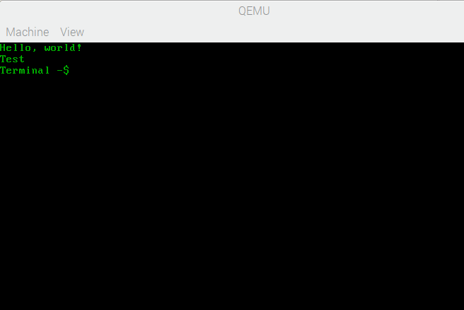

# hello-world-kernel
A simple kernel for i386 CPUs that has a terminal.

# Running
First download the newest kernel.iso from actions tab then...
 * boot with grub  
 or
 * Run with `qemu-system-i386 -kernel kernel.iso`
# Grub config
First rename the kernel.iso file to kernel-1 and add it to /boot directory.
```
title helloWorld
	root (hd0,0)
	kernel /boot/kernel-1 ro
```
# Features
 * idt
 * can write to basic vga video memory.
 * Keyboard support.
 * Has 2 commands.


